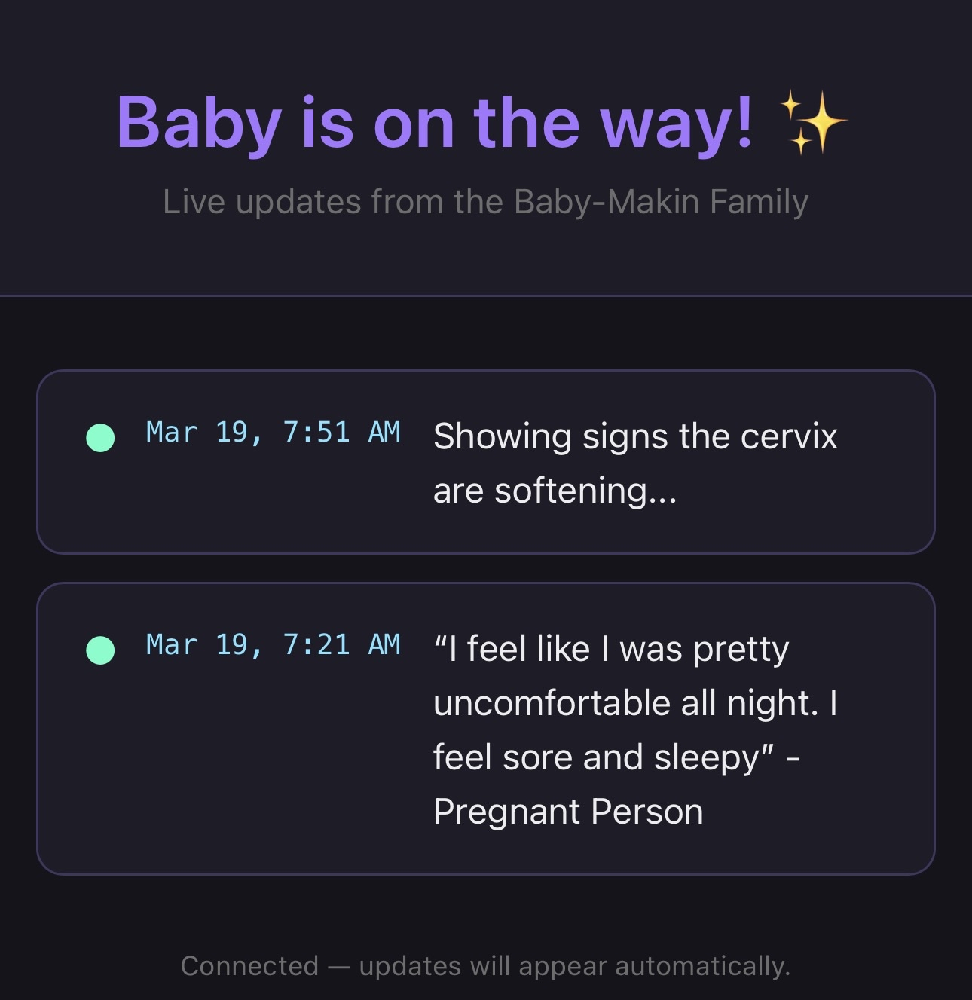

# birth-story

A tiny Go web app that serves a live birth story update page. Post updates from
Discord with `/update <message>` and everyone watching the page sees them appear
in real time — no refresh needed.

> Built with [Claude Code](https://claude.ai/claude-code) by Anthropic.



---

## How it works

```
You (Discord)
    │  /update She's at 8cm!
    ▼
Discord Bot (slash command)
    │  verifies Ed25519 signature, adds to store
    ▼
Go server  ──SSE──▶  Everyone watching the page
```

The binary runs both the web server and the Discord interaction handler. No
database — updates are kept in memory and optionally persisted to a JSON file
so restarts don't wipe the feed.

---

## Environment variables

| Variable              | Required | Default           | Description                                          |
|-----------------------|----------|-------------------|------------------------------------------------------|
| `DISCORD_TOKEN`       | Yes      | —                 | Bot token (Discord Developer Portal → Bot)           |
| `DISCORD_APP_ID`      | Yes      | —                 | Application ID (General Information)                 |
| `DISCORD_GUILD_ID`    | Yes      | —                 | Your server's Guild ID                               |
| `DISCORD_PUBLIC_KEY`  | Yes      | —                 | Public Key (General Information)                     |
| `FAMILY_NAME`         | No       | `Our`             | Last name shown in subtitle: "Live updates from the [X] Family" |
| `TZ`                  | No       | `America/Denver`  | Timezone for timestamps — any [tz database name](https://en.wikipedia.org/wiki/List_of_tz_database_time_zones) |
| `PORT`                | No       | `8080`            | HTTP port                                            |
| `UPDATE_FILE`         | No       | —                 | Path to persist updates as JSON (e.g. `/data/updates.json`) |

Copy `.envrc` and fill in the values.

---

## Discord setup

1. Go to [discord.com/developers/applications](https://discord.com/developers/applications) and create an app.
2. **Bot** tab → Reset Token → save as `DISCORD_TOKEN`.
3. **General Information** → copy `DISCORD_APP_ID` and `DISCORD_PUBLIC_KEY`.
4. Once the server is running and publicly reachable, set the
   **Interactions Endpoint URL** to `https://<your-domain>/interactions` and save.
   Discord will send a ping to verify the endpoint before accepting it.
5. Right-click your Discord server (Developer Mode on) → **Copy Server ID** → `DISCORD_GUILD_ID`.

The `/update` slash command is registered automatically on startup (guild-scoped,
so it appears instantly).

---

## Build & push

```bash
make release          # build + push :latest and :<git-sha> to Docker Hub
make build            # build only
make push             # push only
```

---

## Nomad deployment

Store secrets as a Nomad variable at `secret/discord-birth-story` then run:

```bash
nomad job run birth-story.nomad.hcl

# deploy a specific image tag
nomad job run -var image_tag=abc1234 birth-story.nomad.hcl
```

Example job file:

```hcl
variable "image_tag" {
  type    = string
  default = "latest"
}

job "birth-story" {
  datacenters = ["dc1"]
  type        = "service"

  group "birth-story" {
    count = 1

    network {
      port "http" {
        to = 8080
      }
    }

    service {
      name     = "birth-story"
      port     = "http"
      provider = "nomad"

      tags = [
        "traefik.enable=true",
        "traefik.http.routers.birth-story.rule=Host(`birth-story.example.com`)",
        "traefik.http.routers.birth-story.entrypoints=websecure",
      ]
    }

    task "birth-story" {
      driver = "docker"

      config {
        image = "jheck90/birth-story:${var.image_tag}"
        ports = ["http"]
        volumes = [
          "/mnt/nfs-share/nomad/birth-story:/data"
        ]
      }

      template {
        destination = "${NOMAD_SECRETS_DIR}/env.txt"
        env         = true
        data        = <<EOT
        {{- with nomadVar "secret/discord-birth-story@default" -}}
        {{- range $k, $v := . }}
        {{ $k | toUpper }}={{ $v }}
        {{- end }}
        {{- end }}
        EOT
      }

      env {
        UPDATE_FILE = "/data/updates.json"
        TZ          = "America/Denver"
        FAMILY_NAME = "Smith"
      }

      resources {
        cpu    = 100
        memory = 64
      }
    }
  }
}
```
